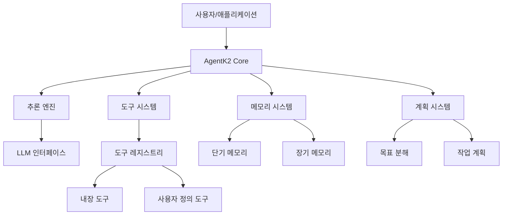

# 아키텍처 개요

AgentK2의 전체 아키텍처와 주요 구성 요소를 소개합니다.

## 시스템 아키텍처

AgentK2는 모듈화된 아키텍처를 기반으로 설계되었습니다. 각 구성 요소는 독립적으로 작동하면서도 유기적으로 연결되어 있어 확장성과 유연성을 제공합니다.

## 주요 구성 요소

### 1. AgentK2 Core

AgentK2의 핵심 모듈로, 모든 구성 요소를 조율하고 에이전트의 생명주기를 관리합니다.

- **에이전트 생성 및 초기화**: 에이전트 인스턴스 생성 및 필요한 리소스 초기화
- **작업 실행 관리**: 사용자 요청을 처리하고 적절한 구성 요소에 작업 할당
- **상태 관리**: 에이전트의 현재 상태 및 컨텍스트 유지
- **이벤트 시스템**: 에이전트 작동 과정에서 발생하는 이벤트 처리

### 2. 추론 엔진

에이전트의 사고 과정을 담당하는 모듈입니다.

- **LLM 통합**: 다양한 언어 모델과의 통합 인터페이스
- **추론 전략**: 단일 단계, 다단계, 사고 트리 등 다양한 추론 방식 지원
- **프롬프트 관리**: 효과적인 추론을 위한 프롬프트 템플릿 및 최적화
- **출력 처리**: 모델 출력 파싱 및 구조화

### 3. 도구 시스템

에이전트가 외부 세계와 상호작용할 수 있게 해주는 모듈입니다.

- **도구 레지스트리**: 사용 가능한 도구 관리 및 접근 제공
- **도구 선택 로직**: 작업에 적합한 도구 자동 선택
- **도구 실행**: 선택된 도구의 안전한 실행 및 결과 처리
- **도구 API**: 사용자 정의 도구 개발을 위한 표준 인터페이스

### 4. 메모리 시스템

에이전트의 기억을 관리하는 모듈입니다.

- **단기 메모리**: 현재 세션 내 대화 및 컨텍스트 유지
- **장기 메모리**: 지속적인 정보 저장 및 검색
- **메모리 인덱싱**: 효율적인 정보 검색을 위한 벡터 인덱싱
- **메모리 관리**: 중요도 기반 메모리 보존 및 삭제

### 5. 계획 시스템

복잡한 목표를 달성하기 위한 계획을 수립하는 모듈입니다.

- **목표 분해**: 복잡한 목표를 관리 가능한 하위 목표로 분해
- **작업 계획**: 목표 달성을 위한 단계별 계획 수립
- **진행 모니터링**: 계획 실행 과정 추적 및 조정
- **장애 복구**: 계획 실행 중 발생하는 문제 해결

## 데이터 흐름

AgentK2 내에서의 데이터 흐름은 다음과 같습니다:

1. 사용자가 에이전트에 작업을 요청합니다.
2. AgentK2 Core가 요청을 받아 처리합니다.
3. 계획 시스템이 작업을 분석하고 필요한 단계를 계획합니다.
4. 추론 엔진이 각 단계에 대한 사고 과정을 수행합니다.
5. 도구 시스템이 필요한 외부 작업을 실행합니다.
6. 메모리 시스템이 관련 정보를 저장하고 검색합니다.
7. 최종 결과가 사용자에게 반환됩니다.

## 확장성

AgentK2는 다음과 같은 방식으로 확장할 수 있습니다:

- **사용자 정의 도구**: 새로운 도구를 개발하여 에이전트의 기능 확장
- **커스텀 추론 전략**: 특정 작업에 최적화된 추론 방식 구현
- **메모리 백엔드 교체**: 다양한 저장소 시스템과 통합
- **LLM 교체**: 다양한 언어 모델과 통합
- **플러그인 시스템**: 추가 기능을 플러그인 형태로 개발 및 통합

## 보안 고려사항

AgentK2는 다음과 같은 보안 기능을 제공합니다:

- **도구 권한 관리**: 도구별 접근 권한 및 제한 설정
- **입력 검증**: 모든 사용자 입력에 대한 검증 및 필터링
- **샌드박싱**: 도구 실행 환경 격리
- **감사 로깅**: 모든 에이전트 활동에 대한 상세 로그 기록
- **데이터 암호화**: 민감한 정보에 대한 암호화 저장
